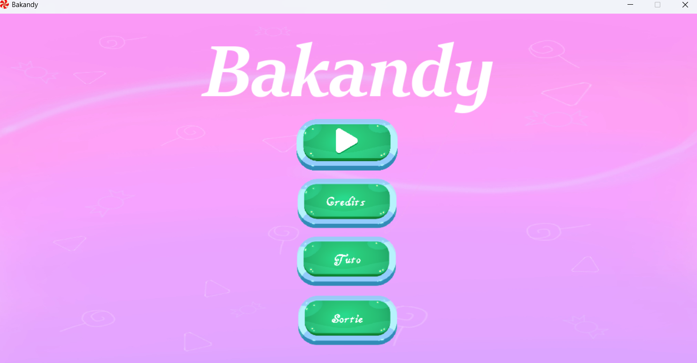
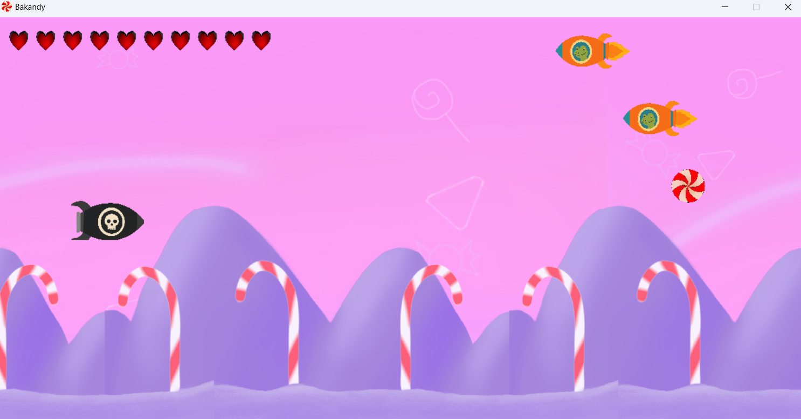
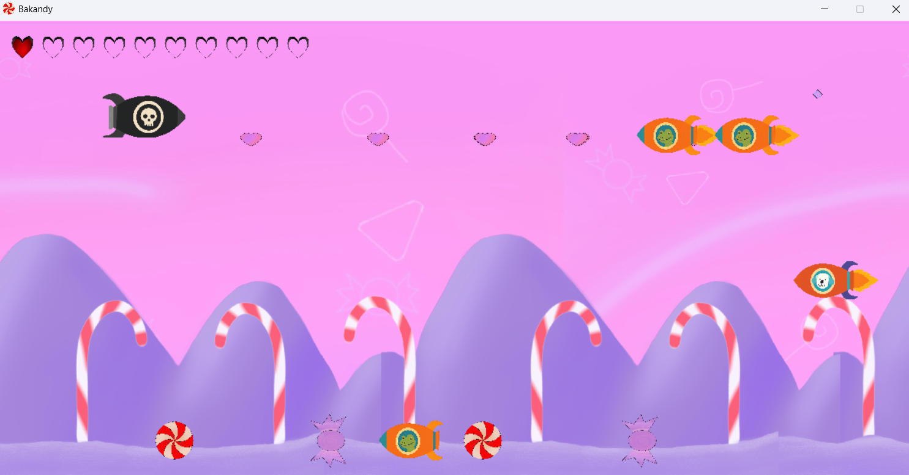

# Bakandy (C++ - SDL)

A shoot'em up made in C++ with SDL lib in 2 weeks

The objective is to survive during all the ennemies waves and defeat the boss. 

## Features
- Controlable spaceship
- Special skill for the player
- Different ennemies with different patterns
- Boss with different skills
- Customisable level (in a level.txt)

## Controles

- Z -> Move up
- S -> Move down
- Q -> Move left
- D -> Move right
- Space -> shoot classic bullet
- E -> Shoot homing bullet

## Screenshots

Menu

Game loop

